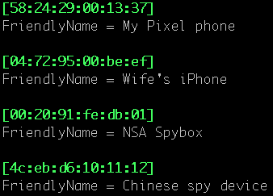

# apls-ng

#### Python wrapper around 'iw' to show clients currently connected to a hostapd AP running on the same system and providing additional context around the output.

###### Initial release: 2023-Nov-09
-------
## Instructions for use:

0. open a terminal
1. run ```git clone https://github.com/theodric/apls-ng.git; cd apls-ng```
2. run ```python3 -m pip install -r requirements.txt```
3. place the ```apls-ng``` script in your PATH
4. (optional) place ```apls-ng.conf``` in ```/etc```, and edit the entries therein to correspond to the systems on your network for which you would like to be provided a Friendly Name in the script's output
5. run ```apls-ng```
-------
## Background
This script is a wrapper around ```iw dev wlan0 station dump```, a command which will list all devices connected to an AP you are running on your Linux system (probably with hostapd). The output from 'iw' is comprehensive, but not particularly readable at a glance. This seeks to improve that.

The script is written for Python3. It structures and prettifies pertinent details about each connected device, and adds additional value in a few ways:
1. pretty colors for 1337 hax0r cred
2. the MAC address' assigned manufacturer is discovered and included in the output data
3. (optional) a 'Friendly Name' can be assigned to known MAC addresses by employing an optional config file.


The script can read a configuration file placed in /etc/apls-ng.conf (or anywhere else, provided that you update the path in the script), in which you may define known MAC addresses and assign a Friendly Name for each.



The Friendly Name will be printed next to the device status in the script output. The script will execute normally without this configuration file being present, and will likewise work if a given MAC address is not specified in the file. In both of these cases the behavior is the same: the device will be simply noted as an "Unidentified device" in the output, but all other data will print normally.

-------
## Notes
If your AP is not running on the 'wlan0' device, you'll need to update the script to reflect the correct interface name. The relevant line in the script has a comment pointing the user to where to make this change.
